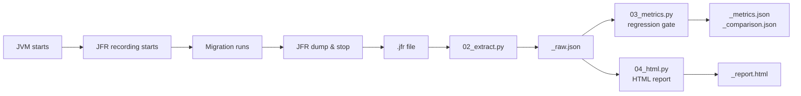
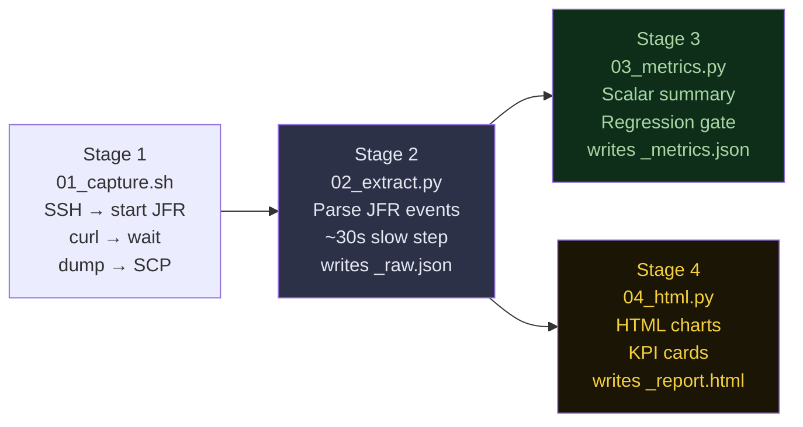
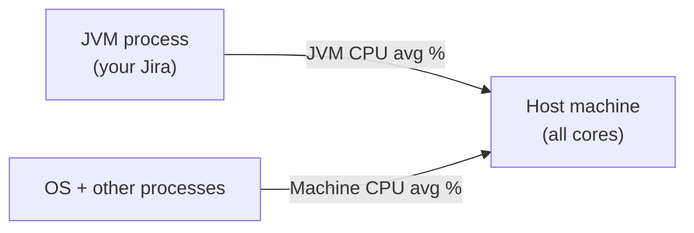
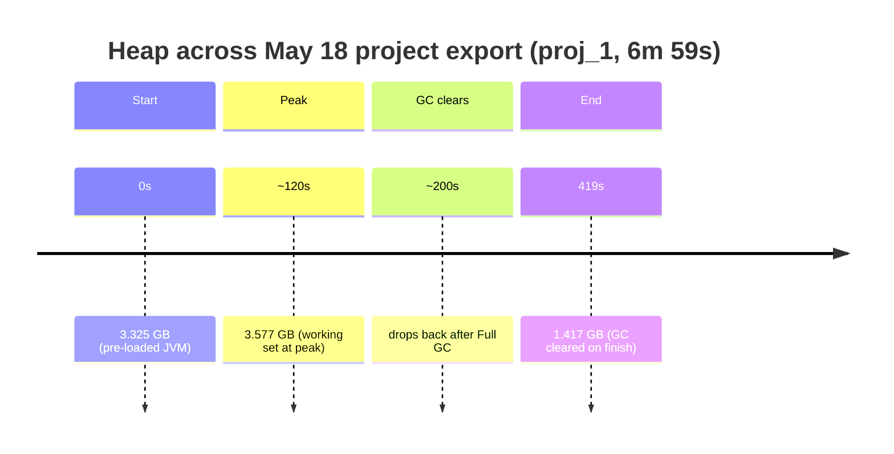
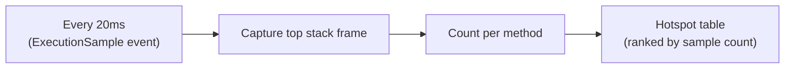
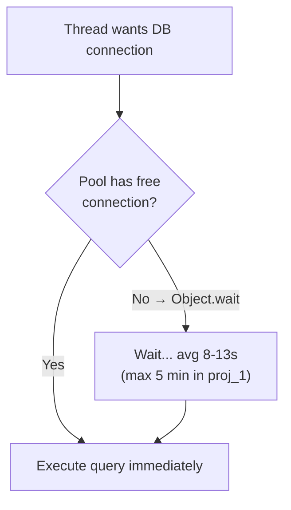
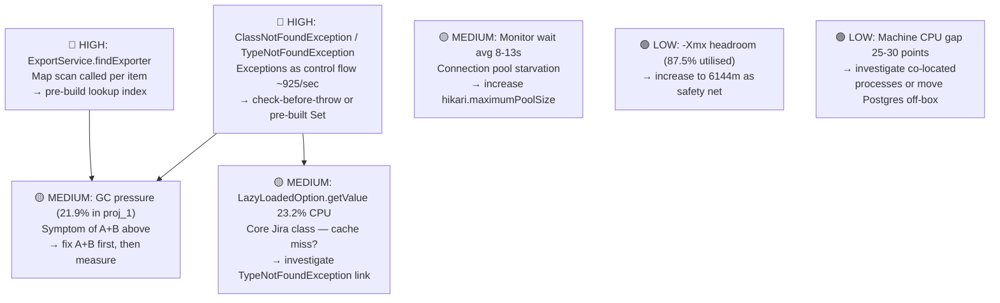
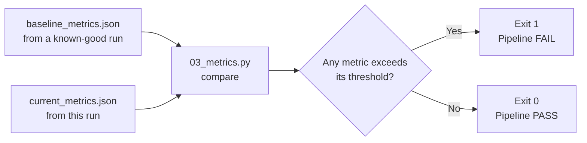
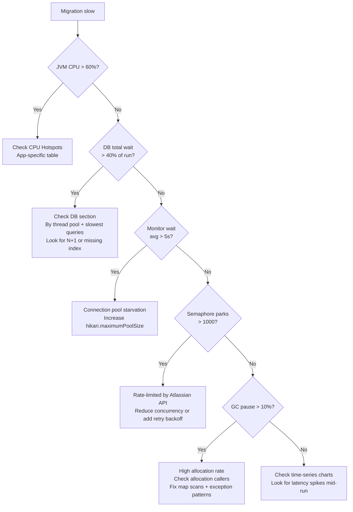

# JFR Profiling Guide — Reading Performance Reports

> Audience: engineers new to profiling. No prior JVM knowledge assumed.
> Examples are real metrics from JCMA migration runs on 18 May.

---

## What is JFR?

Java Flight Recorder (JFR) is a low-overhead profiler built into the JDK. It continuously records JVM events — CPU samples, memory allocations, GC pauses, thread blocking, socket I/O — with less than 1% runtime overhead. Think of it as a flight data recorder for your Java process: it runs silently, and you analyse the recording after the fact.



---

## The Pipeline — 4 Stages



**Key insight:** Stage 2 is the only slow step (~30s). Stages 3 and 4 read from `_raw.json` and run in seconds. If you change threshold values or HTML layout, re-run only stages 3/4 — you never need to re-parse the JFR.

---

## Real Runs — May 18 Overview

Four recordings were captured on 18 May covering two migration phases:

| Run | Phase | Duration | JVM CPU avg | GC pause % | Full GCs | Exceptions |
|-----|-------|----------|-------------|------------|----------|------------|
| user_1 | User migrate | 1m 30s | 15.9% | **12.1%** | **2** | 82,462 |
| user_2 | User migrate | 1m 30s | 15.9% | **12.1%** | **2** | 82,462 |
| proj_1 | Project export | 6m 59s | 51.0% | **21.9%** | **12** | 387,682 |
| proj_2 | Project export | 2m 43s | 43.1% | **15.9%** | **4** | 227,383 |

> user_1 and user_2 produced identical metrics — the same recording was analysed twice. This is harmless; only one run matters for user migration.

**Headline findings before we dive in:**
1. GC is spending 12–22% of runtime on stop-the-world pauses — migration makes zero progress during this time
2. `ExportService.findExporter` is a confirmed hotspot in every single run
3. 387k+ exceptions thrown in a 7-minute project export — using exceptions as control flow
4. Machine CPU consistently 25–30 points above JVM CPU — something else is competing on the host

---

## Metric Reference

### CPU



| Metric | What it measures | Healthy | Warning |
|--------|-----------------|---------|---------|
| **JVM CPU avg %** | % of one CPU core the JVM actively used | < 50% avg | > 80% sustained = CPU-bound |
| **JVM CPU peak %** | Highest single-sample CPU spike | < 90% | Frequent peaks = bursty processing |
| **Machine CPU avg %** | All-core utilisation of the host | Close to JVM CPU | Large gap = noisy neighbour or OS I/O wait |

#### Real example — proj_1

```
JVM CPU avg:     51.0%   ← JVM is fairly busy
Machine CPU avg: 79.4%   ← host is very busy
Gap:             28.4 points
```

A 28-point gap between JVM and Machine CPU means something else is consuming ~28% of the host's compute — likely the OS, PostgreSQL on the same box, or GC-related kernel work. If Postgres runs on the same EC2 instance, the host is under pressure from both sides simultaneously. **Consider a dedicated DB host.**

---

### Memory & Heap



| Metric | user_1 | proj_1 | proj_2 |
|--------|--------|--------|--------|
| Heap start | 3.21 GB | 3.33 GB | 3.11 GB |
| Heap peak | 3.54 GB | 3.58 GB | 3.54 GB |
| Heap end | 1.86 GB | 1.42 GB | 1.70 GB |
| Heap delta | 0.33 GB | 0.25 GB | 0.43 GB |
| GC count | 8 | 82 | 23 |
| **Full GCs** | **2** | **12** | **4** |
| GC total pause | 10.89s | **1.5 min** | 25.85s |
| GC max pause | 5.23s | **8.50s** | 6.71s |
| **GC % of run** | **12.1%** | **21.9%** | **15.9%** |

**Interpretation:**

- All runs are operating near the same heap peak (~3.5 GB) with `-Xmx 4096 MB`. That is 87.5% utilisation — there is very little headroom.
- `proj_1` spent 21.9% of its 7-minute run frozen in GC. **1 in 5 seconds, migration was completely stopped.** This is a direct performance cost, not just a background concern.
- 12 Full GCs in proj_1 (max single pause 8.5s) means Jira was frozen for 8+ seconds at a time.
- Heap delta being small (0.25–0.43 GB) is **not** the problem here. The problem is allocation *rate* — objects are being created and discarded so fast that GC can barely keep up, even though long-term growth is modest. See the Allocation section for the cause.

#### GC danger zones — and what happens at each stage

```
Normal:   GC pause < 5% of run    → healthy, GC is background noise
Caution:  GC pause 5–12%          → noticeable but tolerable
Warning:  GC pause 12–22%         → your current state (user_1: 12.1%, proj_1: 21.9%)
Danger:   GC pause > 30%          → regression threshold — pipeline fails here
Thrashing: GC pause > 50%         → JVM spending more time in GC than doing work
Pre-OOM:  GC pause > 90%          → JVM nearly non-functional, crash imminent
Crash:    GCOverheadLimitExceeded → JVM gives up and throws OOM proactively
```

**What happens at the crash stage:**

`OutOfMemoryError` is not like a regular exception. A regular exception kills one thread; OOM kills the entire JVM.

```
1. Heap fills → GC fires repeatedly, reclaims almost nothing
2. JVM reaches GCOverheadLimit (98% of time in GC) → throws OOM proactively
3. Every thread trying to allocate gets OOM simultaneously
4. Tomcat tries to return a 500 error → needs memory → OOM again
5. JVM process exits → Jira goes completely offline
6. Restart required
```

> **Your proj_1 at 21.9% is solidly in Warning.** It is not crashing today, but if project size grows or the allocation hotspots compound, it will cross 30% (pipeline failure threshold) and eventually reach Danger.

**Does JFR itself cause GC overhead?**

Minimal — JFR was specifically designed for production use. Its own overhead is < 1% CPU and < 1% GC impact. The allocation sampler (`jdk.ObjectAllocationSample`) has a configurable throttle (we set 50/s) so it never floods the GC. What you see in the GC metrics is your application, not JFR. The one caveat: `jdk.ObjectAllocationOutsideTLAB` (large allocations) is unthrottled, but those events are rare by nature. In short: JFR does not meaningfully contribute to the GC numbers you are reading.

**Fix options:**
```
1. -Xmx 6144m  → more headroom, fewer Full GCs (immediate safety net)
2. -XX:+UseZGC  → concurrent GC, eliminates stop-the-world pauses almost entirely
3. Fix allocation hotspots (see below) → reduce GC pressure at source (best long-term fix)
```

---

### Memory Allocation — What & Who

JFR samples object allocations statistically (not every object). Two tables: **what** is being allocated, and **which method in your code** triggered it.

#### JVM type name decoder

| JVM name | Real Java type | Usually from |
|----------|---------------|--------------|
| `[B` | `byte[]` | JSON/HTTP serialisation, DB result rows |
| `[Ljava.lang.Object;` | `Object[]` | ArrayList/HashMap internal resizing |
| `[Ljava.util.HashMap$Node;` | `HashMap$Node[]` | HashMap bucket array |
| `[C` | `char[]` | String construction, string concat in loops |
| `HashMap$Node` | Entry in a HashMap | Any `HashMap.put()` |
| `HashMap$MapEntry` | Entry created during **iteration** | `map.entrySet()` loop — NOT `map.get()` |
| `HashMap$ValueSpliterator` | Iterator for `map.values().stream()` | Map stream/iteration |
| `ReferencePipeline$Head` | First stage of `.stream()` | Any `.stream()` call |

> **`$` in a class name** = inner/nested class. `HashMap$Node` = `HashMap.Node`. `ImmutableCustomField$TypeNotFoundException` = `ImmutableCustomField.TypeNotFoundException`.

#### What is being allocated — proj_1 (6m 59s)

| Class | Sampled MB | Samples | Signal |
|-------|-----------|---------|--------|
| `[Ljava.lang.Object;` | **30,032 MB** | 17,195 | Massive Object[] churn — ArrayList/HashMap resizing |
| `HashMap$Node` | **14,922 MB** | 9,110 | Enormous number of HashMap puts |
| `[B` (byte[]) | **11,370 MB** | 11,088 | JSON serialisation / DB rows |
| `net.sf.ehcache.Element` | **10,088 MB** | 6,047 | ehcache wrapping every cached object |
| `[Ljava.util.HashMap$Node;` | **8,085 MB** | 5,333 | HashMap bucket arrays (resizing) |

30 GB of `Object[]` allocation in a 7-minute run. The JVM is allocating and immediately discarding roughly **70 MB/s** of object arrays alone. This is entirely consistent with the 21.9% GC pause — the GC is struggling to keep pace.

#### Who is allocating — proj_1 callers

| Method | Sampled MB | Top types |
|--------|-----------|-----------|
| `ExportService.findExporter` | **1,345.6 MB** | `ConcurrentHashMap$MapEntry(756)` |
| `CustomFieldUtils.getCloudAppTypeKeyMapping` | **1,086.7 MB** | — |
| `ExportFilters.getSupportedCustomFieldTypes` | **1,009.8 MB** | — |
| `AppVendorMinimalContext.<init>` | **563.3 MB** | — |
| `MriExtensionsKt.mri` | **430.2 MB** | — |

**Three methods (findExporter, getCloudAppTypeKeyMapping, getSupportedCustomFieldTypes) together account for ~3,400 MB of allocation per 7-minute run.** All three are utilities called per-item — see Action Items below.

#### proj_2 — an additional signal

```
HashMap$ValueSpliterator  — 3,737.2 MB  from only 41 samples
```

41 samples but 3.7 GB. Each sample carried enormous weight (~91 MB each). This means a **very large map is being iterated via `.values().stream()`** — not many times, but the map itself is huge. Each call to `map.values().stream()` on a large ConcurrentHashMap creates one `ValueSpliterator`. The 3.7 GB cost is the map contents being touched, not the spliterator itself.

---

### CPU Hotspots

JFR takes a stack snapshot every **20ms**. The top frame of each snapshot = the method executing at that instant.



**Samples ≠ call count.** A method called once that runs for 2 seconds = 100 samples. A method called 10,000 times but taking 0.1ms each = ~5 samples. Samples measure **total CPU time**, not frequency.

#### Top methods (all) — proj_1 (17,907 total samples)

| Method | Samples | % | What it means |
|--------|---------|---|---------------|
| `HashMap$TreeNode.getTreeNode` | 1,436 | 14.9% | HashMap tree-mode lookups — high collision bucket |
| `ThreadLocal$ThreadLocalMap.getEntryAfterMiss` | 766 | 8.0% | ThreadLocal miss — wrong thread context |
| `EntityUtil.filterByAnd` | 699 | 7.3% | OFBiz entity filtering — linear scan |
| `HashMap.putVal` | 639 | 6.6% | Massive HashMap inserts |
| `ImmutableSet$RegularSetBuilderImpl.insertInHashTable` | 611 | 6.3% | Guava immutable set construction in hot path |

Three of the top 5 are HashMap operations — the JVM is spending ~37% of all CPU time doing HashMap work. This is consistent with the allocation data (14,922 MB of `HashMap$Node`). **HashMap is being rebuilt constantly instead of being reused.**

`ThreadLocal.getEntryAfterMiss` at 8% is unusual. This happens when a thread accesses a ThreadLocal that was created on a different thread, or when the ThreadLocal table is full. In a migration context this often means thread-pool threads are accessing data that wasn't set up on their context.

#### App-specific hotspots — ExportService.findExporter across all runs

```
               user_1   proj_1   proj_2
Samples:          5       115       69
Share of app:   22.7%   34.2%    48.6%   ← growing dominance
Alloc MB:        —      1345.6   474.7
```

`findExporter` is the single most expensive method in your migration code across every run. In proj_2 it accounts for **nearly half of all migration-specific CPU time**. It also drives the #1 allocation hotspot.

#### proj_2 surprise — a non-migration method on top

```
com.atlassian.jira.issue.customfields.option.LazyLoadedOption.getValue
  → 592 samples (23.2% of ALL 4,891 samples)
```

This is **not** in the migration package but dominates the entire JVM. `LazyLoadedOption` lazily loads custom field option labels. At 23.2% of all CPU samples it is being called millions of times during the export. This is a Jira core class — it likely has a cache, but something is causing repeated cache misses. Worth cross-referencing with `ImmutableCustomField$TypeNotFoundException` in the exceptions section.

---

### Exceptions — Control Flow Anti-Pattern

| Run | Count | Duration | Rate |
|-----|-------|----------|------|
| user_1 | 82,462 | 1m 30s | **915/sec** |
| proj_1 | 387,682 | 6m 59s | **925/sec** |
| proj_2 | 227,383 | 2m 43s | **1,394/sec** |

All three runs produce ~900–1,400 exceptions per second throughout the recording. This is the signature of **using exceptions as control flow**.

#### proj_1 top exception types

| Exception | Count | % | Root cause |
|-----------|-------|---|------------|
| `ClassNotFoundException` | 169,224 | 43.7% | Class lookup failing repeatedly — caught and ignored |
| `ImmutableCustomField$TypeNotFoundException` | 166,471 | 43.0% | Custom field type not found — caught and treated as "unsupported" |
| `MismatchedInputException` | 24,691 | 6.4% | JSON deserialisation mismatch — caught and skipped |
| `AttributeNotFoundException` | 13,335 | 3.4% | Entity attribute lookup failing — used as "absent" signal |
| `NullPointerException` | 4,981 | 1.3% | Unexpected nulls |

`ClassNotFoundException` and `TypeNotFoundException` together = **86.7% of all exceptions**, both thrown at ~925/sec. The pattern is almost certainly:

```java
// Current — throws and catches ClassNotFoundException 169k times
try {
    Class<?> cls = Class.forName(typeName);
} catch (ClassNotFoundException e) {
    return null; // treat as unsupported
}

// Fix — check first, O(1), zero exceptions
private static final Set<String> KNOWN_TYPES = Set.of(...);
if (!KNOWN_TYPES.contains(typeName)) return null;
```

**Why this matters:** Every thrown exception in Java generates a full stack trace — roughly 3–10 µs of CPU per throw. At 925/sec that is **~5–9ms of CPU per second** wasted purely on stack trace generation. Over a 7-minute run that adds up to **~3.5–6.3 seconds of CPU** burned on exceptions that should never be thrown.

This also directly links to `ImmutableCustomField$TypeNotFoundException` — same pattern in `LazyLoadedOption.getValue`. The Jira core class is throwing `TypeNotFoundException` to signal "this custom field type isn't supported", and migration code is catching it. This explains why `LazyLoadedOption.getValue` sits at 23.2% of CPU samples in proj_2.

---

### Thread Blocking

#### Thread Park — proj_1

| Category | Count | Total | Share |
|----------|-------|-------|-------|
| ✅ Idle thread-pool | 23,003 | — | 98.5% |
| ⚠️ Semaphore/rate-limit | **4,896** | — | **0.3%** |
| ⚪ Other | 91 | — | 1.2% |

4,896 semaphore parks in proj_1 vs 1,886 in proj_2 (shorter run). The rate is similar — ~700/minute. This is the Atlassian rate limiter throttling outbound API calls during export. It's expected behaviour but confirms the export is hitting rate limits on API calls to `api.atlassian.com`.

#### Monitor Wait — potential connection pool starvation

| Run | Events | Total | Avg per event | Max single |
|-----|--------|-------|---------------|------------|
| user_1 | 52 | 11.5 min | **13.30s** | 1.7 min |
| proj_1 | 409 | 59.0 min | **8.66s** | **5.0 min** |
| proj_2 | 168 | 19.4 min | **6.94s** | 1.0 min |

`Object.wait()` with an average of 8–13 seconds means threads are **waiting 8–13 seconds just to get a DB connection from the pool**. The max of 5 minutes in proj_1 means one thread waited 5 full minutes for a connection. This is connection pool starvation.



The fix is to increase the DB connection pool size (`hikari.maximumPoolSize`) or reduce the number of concurrent threads making DB calls — the current thread count (378 peak) likely far exceeds available connections.

---

### Socket I/O — DB

| Run | Queries | Avg latency | p95 latency | Max | Total wait |
|-----|---------|-------------|-------------|-----|-----------|
| user_1 | 100 | 167ms | 992ms | 2.18s | 16.72s |
| proj_1 | 198 | 47ms | 129ms | 210ms | 9.35s |
| proj_2 | 97 | 48ms | 154ms | 183ms | 4.70s |

User migration has significantly higher DB latency (avg 167ms vs ~48ms for project export). The p95 of 992ms means 5% of queries take nearly a second. Combined with monitor wait showing 13s average connection wait, user migration DB work is the dominant performance bottleneck for that phase.

Project export DB latency is healthy (48ms avg), but query count is low relative to what's being processed — suggesting most work is in-memory (which explains the CPU and allocation pressure).

---

## Action Items — Ranked by Impact



### Fix 1 — ExportService.findExporter (highest ROI)

Confirmed in every run. Called once per exported item (issue, user, etc.), scans the entire exporters map each time.

```java
// Current — O(n) scan per item, creates MapEntry on each call
public Exporter findExporter(String type) {
    return exporters.entrySet().stream()
        .filter(e -> e.getValue().supports(type))
        .map(Map.Entry::getValue)
        .findFirst()
        .orElseThrow();
}

// Fix — build index once at startup, O(1) thereafter
private final Map<String, Exporter> byType;

@PostConstruct
void init() {
    byType = exporters.values().stream()
        .collect(Collectors.toMap(Exporter::getSupportedType, e -> e));
}

public Exporter findExporter(String type) {
    return byType.get(type);  // zero allocations, zero CPU
}
```

Expected impact: proj_1 app-specific CPU from 34.2% to near 0%, ~1,345 MB allocation eliminated per run.

### Fix 2 — Exception-as-control-flow (ClassNotFoundException / TypeNotFoundException)

```java
// Current pattern (inferred from exception type + rate)
try {
    return registry.getType(fieldTypeName);
} catch (TypeNotFoundException e) {
    return null;
}

// Fix — check before accessing
if (!registry.hasType(fieldTypeName)) return null;
return registry.getType(fieldTypeName);

// Or for ClassNotFoundException pattern:
private static final Set<String> KNOWN = buildKnownSet(); // once at startup
if (!KNOWN.contains(className)) return null;
```

Expected impact: ~900/sec exception rate → near zero, GC pressure reduced, `LazyLoadedOption.getValue` CPU share drops.

### Fix 3 — CustomFieldUtils.getCloudAppTypeKeyMapping (same root cause as Fix 1)

Appears as #2 allocation caller in proj_1 (1,086 MB) and #3 in proj_2 (134 MB). Same pattern — rebuilding a mapping on every call.

```java
// Cache the mapping at class/bean level instead of recomputing per call
private static final Map<String, String> CLOUD_TYPE_MAP = buildTypeMap();
```

---

## How the Baseline & Regression Gate Works



**13 metrics compared, each with its own threshold:**

| Metric | Default threshold | Rationale |
|--------|------------------|-----------|
| JVM CPU avg | +30% | CPU growth signals algorithmic regression |
| Heap peak | +30% | Memory growth before OOM |
| Heap delta | +30% | Growing delta = new allocation hotspot |
| GC total pause | +30% | > 30% of run = Danger zone, migration nearly stalled |
| **GC full count** | **+0** | **Any new Full GC = regression, no tolerance** |
| DB reads | +20% | Query count growth = N+1 regression |
| DB avg latency | +30% | Latency growth = index missing or lock contention |
| API avg latency | +30% | External service degradation |
| Thread park total | +30% | Blocking growth = new contention |
| Peak threads | +20% | Thread leak |
| Exceptions | +50% | Error rate growth |

**Creating a baseline:**
```bash
cp perf_output/user_migrate_metrics.json   perf_v2/baselines/user_migrate_baseline.json
cp perf_output/project_export_metrics.json perf_v2/baselines/project_export_baseline.json
git add perf_v2/baselines/ && git commit -m "Update JFR baselines"
```

---

## Investigation Recipes

### "Migration is slow — where to start?"



### "GC is high — is it the code or do I just need more memory?"

If heap delta is stable run-over-run (no leak) but GC pause is still high: it's **allocation rate**, not heap size. Adding more `-Xmx` delays but doesn't fix the underlying issue. The fix is reducing allocations (see Fix 1–3 above). Adding ZGC is a good safety net that eliminates pause time without fixing root cause.

### "Exceptions are high — what's throwing?"

1. Check Top types in Exceptions section
2. If `ClassNotFoundException` or `TypeNotFoundException` in bulk: exception-as-control-flow — add pre-check
3. If `SocketTimeoutException`: cross-check API latency chart for spikes
4. If `NullPointerException` in bulk: data quality issue — add null guards upstream

---

## Running the Tools

```bash
# Analyse an existing JFR file (most common case)
./perf_v2/run_analyse.sh \
  --jfr      perf_output/user_migrate.jfr \
  --baseline perf_v2/baselines/user_migrate_baseline.json

# Re-generate HTML only (no JFR re-parse — instant)
python3 perf_v2/04_html.py \
  --raw perf_output/user_migrate_raw.json \
  --out perf_output \
  --baseline perf_v2/baselines/user_migrate_baseline.json

# Full pipeline from EC2
./perf_v2/run_pipeline.sh \
  --host        ec2-xx-xx.compute.amazonaws.com \
  --jira-pass   secret \
  --project-key MYPROJ \
  --baseline-user-migrate   perf_v2/baselines/user_migrate_baseline.json \
  --baseline-project-export perf_v2/baselines/project_export_baseline.json
```

---

## Glossary

| Term | Definition |
|------|-----------|
| **JFR** | Java Flight Recorder — built-in JDK profiler, < 1% overhead |
| **Heap** | Memory region where Java objects live. Managed by GC. |
| **-Xmx** | Maximum heap size. JVM throws OutOfMemoryError if exceeded. Set to 4096 MB on this instance. |
| **GC** | Garbage Collector — periodically frees unreachable objects |
| **Full GC** | Stop-the-world collection — freezes ALL threads. Should be 0. |
| **GC pause %** | Fraction of run spent frozen in GC. > 5% is a concern; 21.9% is severe. |
| **Thread park** | Thread voluntarily suspends waiting for a signal |
| **Monitor wait** | Thread called `Object.wait()` — typically waiting for a DB connection |
| **ExecutionSample** | JFR event: top stack frame captured every 20ms |
| **AllocationSample** | JFR event: object allocation sampled statistically |
| **p95 latency** | 95th percentile — 95% of requests completed within this time |
| **N+1 query** | Anti-pattern: 1 query to fetch a list, then 1 query per item = N+1 total |
| **Sampled MB** | Estimated allocation size — proportional, not exact |
| **[B, [C, [I** | JVM array type codes: byte[], char[], int[] |
| **`$` in class name** | Inner class separator: `HashMap$Node` = `HashMap.Node` |
| **Control flow via exceptions** | Using try/catch instead of an if-check to handle an expected condition. Expensive: every throw generates a stack trace. |
| **Connection pool starvation** | More threads want DB connections than the pool has available. Manifests as high Monitor wait avg. |
